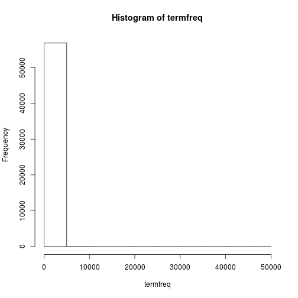

Previsão de palavras
========================================================
author: Frederico Caram Luiz
date: 
autosize: true

Estatisticas amostrais
========================================================

Quartis

```
    Min.  1st Qu.   Median     Mean  3rd Qu.     Max. 
    1.00     1.00     1.00    13.91     4.00 47910.00 
```

Desvio padrão e variância

Desvio Padrão 258.42

Variância 258.42

Distribuição das Palavras
========================================================
Uma imensa parte das palavras ocorre apenas uma vez.


Principais palavras
========================================================


